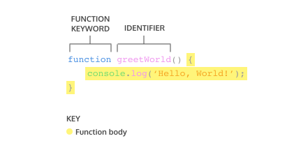

# learn-js
A personal repository to collate my learnings for JavaScript

## Data Types 
- Number (Primitive)
  any number, including numbers with decimals, (`2`, `3.142`, `100`)
- String (Primitive)
  grouping of characters on your keyboard, (`"this is a String"`, `'this is also a String'`)
- Boolean (Primitive)
  boolean values are only ever 1 of 2 values (`true`, `false`)
- Null (Primitive)
  this data type represents the intentional absnce of a value, and is represented by the keyword `null` (without quotes!)
- Undefined (Primitive)
  this data type is denoted by the keyword `undefined` (without quotes). It also represents the absence of a value although it has a different use than `null`. `undefined` means that a given value does not exist
- Symbol (Primitive)
  A newer feature to the language, symbols are unique identifiers, useful in more complex coding. No need to worry about these for now.
- Object
  Collections of related data.

## Arithmetic Operators 
- Add: `+`
- Subtract: `-`
- Multiply: `*`
- Divide: `/`
- Remainder/Modulo: `%`

## String Concatenation 
Similar to Java, JavaScript concatenates data types with the use of the `+` operator. Do note however that since Strings in JavaScript can be represented by enclosing `"`s or `'`s, we can concatenate Strings with `"` or `'` (similarly to Python).

## Properties 
Each data has specific properties that are passed down to each instance. Such properties are accessible with the dot operator (`.`).
e.g. `'Hello World!'.length` returns `11`.

## Methods
Similar to properties, each data has specific methods that can be performed. These methods are characterized by 3 features: 
1. a period (the dot operator, `.`)
2. the name of the method 
3. opening & closing parentheses 
4. arguments (optional - some methods don't require arguments)

## Built-In Objects 
In addition to console, there are other additional objects built into JavaScript. 
These include the `Math`, `Integer`, ... libraries.

## Variables 
Variables are containers for values. 
A variable can be created in the following ways: 
* Pre-ES6
  - `var myName = 'Sam';` 
* ES6
  - `let myName = 'Sam';`
    Note that the usage of `let` signals the variable _can_ be reassigned a different value!
    In the event a variable isn't assigned at declaration, its default value will be `undefined`, as the example follows. 
    `let myName;`
  - `const myName = 'Sam';` 
    The `const` keyword is short for constant & strictly defines a variable cannot be reassigned. Trying to reassign a `const` variable throws `TypeError`.
    Additionally, `const` variables **MUST** be assigned a value when declared.

## Mathematical Assignment Operators 
- `+=`: `item1 += item2` performs the same as `item1 = item1 + item2`
- `-=`: `item1 -= item2` performs the same as `item1 = item1 - item2`
- `*=`: `item1 *= item2` performs the same as `item1 = item1 * item2`
- `/=`: `item1 /= item2` performs the same as `item1 = item1 / item2`

## Increment & Decrement Operators
- `++` 
- `--` 

## String Interpolation (ES6)
In the ES6 version of JavaScript, we can insert, ot _interpolate_, variables into strings using template literals (Similar to `f-strings` in Python).
```js
let myPet = 'cat';
console.log(`I own a pet ${myPet}.`);
```
Note these important characteristics:
- A template literal uses backticks ```, not quotation marks `"`!
- Placeholders are used inside the template literal & resemble `${myPet}`

## `typeof` operator 
The `typeof` operator checks the value of the data type.

## Conditional Statements 

### If statements 
`if` statements in JavaScript are structured as follows: 
```js
if (/* conditional statements */) {
  // code to execute if conditional statements evaluate to true
}
```

### If-Else statements 
`if-else` statements are structured as follows: 
```js
if (/* conditional statements */) {
  // code to execute if conditional statements evaluate to true 
} else {
  // code to execute if conditional statements do not evaluate to true 
}
```

### Comparison operators 
- Less than: `<`
- Greater than: `>`
- Less than or equal to: `<=`
- Greater than or equal to: `>=`
- Is equal to: `===`
- Is not equal to: `!==`

### Logical operators 
- and operator: `&&`
- or operator: `||`
- not operator, otherwise known as the bang operator: `!`

### Truthy & Falsy
In cases of non-boolean data types, we sometimes want to check if a variable exists & not necessarily if the variable is equals to a specific value.
A variable is _truthy_ if it has been assigned a non-falsy value.
A list of falsy values are:
- `0`
- Empty strings like `""` or `''`
- `null` which represent when there is no value at all
- `undefined` which represent when a declared variable lacks a value
- `NaN`, or Not a Number

### Truthy & Falsy Assignment (Short-Circuit Evaluation)
An example of utilizing truthy & falsy assignment is setting up a personalized greeting. The bottom example shows a way of doing it.
```js
let username = '';
let defaultName;
 
if (username) {
  defaultName = username;
} else {
  defaultName = 'Stranger';
}
 
console.log(defaultName); // Prints: Stranger
```
Although this approach is correct, we can utilize **short-circuit evaluation** to further reduce the number of lines of code.
```js
let username = '';
let defaultName = username || 'Stranger';
 
console.log(defaultName); // Prints: Stranger
```
Because || or statements check the left-hand condition first, the variable defaultName will be assigned the actual value of username if it is truthy, and it will be assigned the value of 'Stranger' if username is falsy.

### Ternary Operators 
if-else statements can be condensed into a ternary operator 
`statementToEvaluate ? codeToExecuteIfTrue : codeToExecuteIfFalse ;`

### Switch Statements
```js
let groceryItem = 'papaya';
 
switch (groceryItem) {
  case 'tomato':
    console.log('Tomatoes are $0.49');
    break;
  case 'lime':
    console.log('Limes are $1.49');
    break;
  case 'papaya':
    console.log('Papayas are $1.29');
    break;
  default:
    console.log('Invalid item');
    break;
}
 
// Prints 'Papayas are $1.29'
```

## Functions 
In JavaScript, there are many ways to create a JavaScript function. One way is to use a _function declaration_. 

### Function Declaration 



```js
greetWorld();

function greetWorld() {
  console.log('Hello, World!');
}
```

Note: 
- In the code sample above, the function `greetWorld()` was called before the function was declared. This is _hoisting_. Note that this isn't **best practice**. Read more [here](https://developer.mozilla.org/en-US/docs/Glossary/Hoisting).

### Calling a Function 

The control flow for a function call is pictured in the diagram below. 


Note that writing a function merely declares the existence of the function but doesn't execute it!

### Parameters and Arguments 

**Parameters** of a function are defined when the function is declared.


But **arguments** are the values passed into the function when the function is called. 


### Default Parameters 
One of the features added in ES6 is the ability to use default parameters. Default parameters allow parameters to have a predetermined value in case there is no argument passed into the function or if the argument is undefined when called. 

```js
function greeting (name = 'stranger') {
  console.log(`Hello, ${name}!`)
}
 
greeting('Nick')  // Output: Hello, Nick!
greeting()        // Output: Hello, stranger!
```

As per the code block above, when no argument is passed into the function, the default value (in this case `stranger`) is used. But if an argument is used, then the argument's value will be used.

### Return 
In previous sections, functions were not defined to return a value. By default, the resulting value of calling a function is `undefined`. Functions can return a specific value by defining it as such: 

```js
function calculateArea(height, width) {
  let area = height * width;
  return area;
}
```

### Function Expressions 

Another way to define a function is to use a function expression. To define a function inside an expression, we can use the `function` keyword. Note that in a function expression, the function name is usually omitted. A function with no name is called an anonymous function. A function expression is often stored in a variable in order to refer to it.


To declare a function expression:
- Declare a variable to make the variable’s name be the name, or identifier, of your function. Since the release of ES6, it is common practice to use const as the keyword to declare the variable.
- Assign as that variable’s value an anonymous function created by using the function keyword followed by a set of parentheses with possible parameters. Then a set of curly braces that contain the function body.

> To invoke a function expression, write the name of the variable in which the function is stored followed by parentheses enclosing any arguments being passed into the function.

```js
const calculatePerimeter = function(length, breadth) {
  return 2 * (length + breadth);
}

calculatePerimeter(3.1, 5.3);
```

Note: 
- function expressions are not hoisted so they cannot be called before they are defined

### Arrow Functions

ES6 introduced arrow function syntax, a shorter way to write functions by using the special “fat arrow” () => notation.

```js
const sayGreetings = (designation, name) => {
  console.log(`Good Morning ${designation} ${name}!`);
}
```
