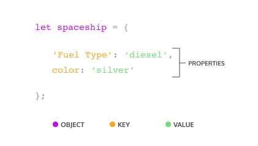
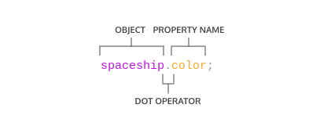
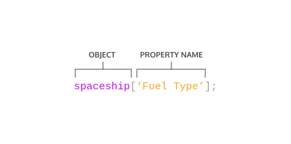

# JavaScript Syntax - Part 2

## Arrays 

### Declaring Arrays with `let` & `const`

You may recall that you can declare variables with both the `let` and `const` keywords. Variables declared with `let` can be reassigned whilst variables declared with the `const` keyword cannot be reassigned. 

However, elements in an array declared with `const` remain mutable. Meaning that we can change the contents of a `const` array, but cannot reassign a new array or a different value to the `const` variable.

```js
let array1 = ['spoon', 'fork']
let array2 = ['milk', 'cereal']

array1[0] = 'knife'                 // allowed!
array2[0] = 'kiwi'                  // allowed!

array1 = ['knife', 'soup spoon']    // allowed!
array2 = ['kiwi', 'almond']         // not allowed!
```

Note:
- In JavaScript, declaring an array with the keyword `const` means that variable will always be holding an array of a certain size (size of the array it was declared with) throughout its lifetime.

### `.length` property of arrays

We can use the `.length` property to find out the length of arrays.

```js
let array1 = [1, 2, 3, 4, 5];
console.log(array1.length);
```

### Array Operations 

1. `push(item)`
   - Appends an item to the end of the array.
2. `pop()`
   - Removes the last item of the array. 

Further details on Array operations can be found [here](https://developer.mozilla.org/en-US/docs/Web/JavaScript/Reference/Global_Objects/Array).

### Data Type of Arrays

Similar to Python, JavaScript arrays can store different data types in an array. These means string, arrays, integers can all reside within the same array.

`const sampleArray = ['waffles', 123, ['pancakes', 'maple syrup'], 2.43];`

## For Loops 

For Loops help us iterate over an array, or repeat the same block of code over & over again. 

```js
for (let i = 0; i < 4; i++) {
    // do something
}
```

## For-Of Loops 

A permutation of the For Loop is the For-Of Loop. This is similar to Java's `for-each` loop.

```js
const hobbies = ['singing', 'eating', 'quidditch', 'writing'];
 
for (const hobby of hobbies) {
  console.log(`I enjoy ${hobby}.`);
}
```

JavaScript's `for-of` loop can be used to iterate through characters of a String.

```js
const username = 'joe';
 
for (const char of username) {
  console.log(char);
}

/*
    The above prints:
    j
    o
    e
*/
```

Java's `for-each` loop looks like this:

```java
int[] arr = new int[] {1, 2, 3, 4, 5};

for (int i: arr) {
    System.out.println("item: " + i);
}
```

## While Loops 

While Loops help us iterate over a block of code as long as a conditional statement is met. 

```js
while (/* conditional statement */) {
    // do something
}
```

## Do-While Loops 

Do-While Loops **execute a block of code once**, before repeatedly executing that block of code as long as a conditional statement is met.

```js
do {
    // do something 
} while (/* conditional statement */);
```

## Other useful statements & declarations / control flow logic

- `break`
  terminates the current loop, switch, or label statement and transfers program control to the statement following the terminated statement
- `continue`
  terminates the current execution & goes to the next iteration

Source: [link](https://developer.mozilla.org/en-US/docs/Web/JavaScript/Reference/Statements)

## Objects 

Objects can be assigned to variables just like any JavaScript type. We use curly braces, {}, to designate an object literal:

`let spaceShip = {}; // spaceShip is an empty object literal`

We fill an object with unordered data. This data is organized into key-value pairs.

We make a key-value pair by writing the key’s name, or identifier, followed by a colon and then the value. We separate each key-value pair in an object literal with a comma (,). Keys are strings, but when we have a key that does not have any special characters in it, JavaScript allows us to omit the quotation marks:



### Accessing Properties 

There are 2 ways we can access an object's property: 
1. dot notation `.`

   

   We can access the property of an object by directly calling it with the dot operator:
   ```js
   let spaceShip = {
      homePlanet: 'Earth',
      color: 'silver'
   }
   spaceship.homePlanet; // Returns 'Earth'
   spaceship.color; // Returns 'silver'
   ```

2. bracket notation `[]`

   Note that we **have** to use bracket notation when accessing keys that have numbers, spaces, or special characters in them!

   

   Another note: The example below shows how using bracket notation & dot notation to access an object's property can lead to very different outcomes!

    <table>
      <tr>
      <th>Dot Operator</th>
      <th>Bracket Notation</th>
      </tr>
      <tr>
      <td>
        
      ```js
      let returnAnyProp = (objectName, propName) => objectName[propName];
      ```
        
      </td>
      <td>

      ```js
      let returnAnyProp = (objectName, propName) => objectName.propName;
      ```

      </td>
      </tr>
      <tr>
      <td>The `returnAnyProp` function accesses the `propName` property of the object `objectName`, meaning `objectName` has a property with same name as the value stored in `propName`.</td>
      <td>The `returnAnyProp` function accesses the literal `propName` property of the object `objectName`, meaning `objectName` has a property named `propName`.</td>
      </tr>
    </table>

### Property Assignment 

Objects are mutable meaning we can update them after we create them!

We can use either dot notation, `.`, or bracket notation, `[]`, and the assignment operator, `=` to add new key-value pairs to an object or change an existing property.

One of two things can happen with property assignment:
1. If the property already exists on the object, whatever value it held before will be replaced with the newly assigned value.
2. If there was no property with that name, a new property will be added to the object.

It’s important to know that although we can’t reassign an object declared with const, we can still mutate it, meaning we can add new properties and change the properties that are there.

```js
const spaceship = {type: 'shuttle'};
spaceship = {type: 'alien'};        // TypeError: Assignment to constant variable.
spaceship.type = 'alien';           // Changes the value of the type property
spaceship.speed = 'Mach 5';         // Creates a new key of 'speed' with a value of 'Mach 5'
```

### Property Deletion

We can also delete properties from an object with the `delete` keyword.

```js
const spaceship = {
  'Fuel Type': 'Turbo Fuel',
  homePlanet: 'Earth',
  mission: 'Explore the universe' 
};
 
delete spaceship.mission;  // Removes the mission property
```

### Methods

Methods for objects can be created in the following manner:

```js
let spaceShip = {
  takeOff() {
    console.log('3...2...1...Launch!');
  },
  preFlightChecks() {
    console.log('checking appartus... all clear!');
  }
}
```
